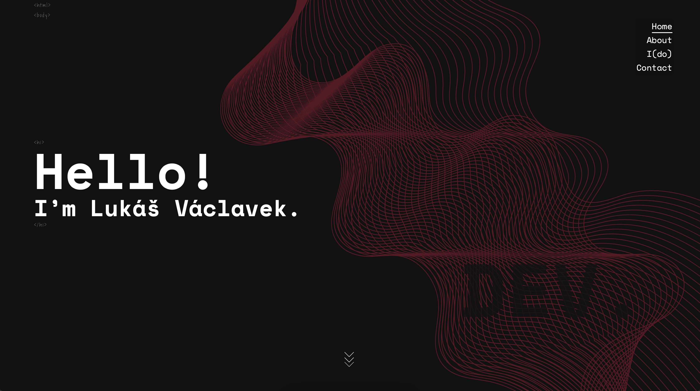

# Lukáš Václavek - Personal Web Portfolio

Welcome to my personal web portfolio! This repository contains the source code for my personal website where I showcase my skills, projects, and provide information about myself.

## Table of Contents

- [About](#about)
- [Portfolio](#portfolio)
- [Contact](#contact)
- [Getting Started](#getting-started)
- [License](#license)

## About

This website serves as my personal web portfolio, showcasing my skills, experience, and projects as a full-stack developer. It includes various sections such as an introduction, an about me section, a portfolio of my projects, and ways to get in touch with me.

## Portfolio

The portfolio section highlights some of my notable projects. Each project includes a brief description and links to live demos or GitHub repositories. It provides visitors with a glimpse of my technical capabilities and the types of projects I've worked on.

## Contact

In the contact section, I provide links to my LinkedIn profile, GitHub account, and email. This makes it easy for visitors to connect with me and learn more about my work.

## Getting Started

To view the website locally, follow these steps:

1. Clone this repository: `git clone https://github.com/Vacii/personal-portfolio.git`
2. Navigate to the project folder: `cd personal-portfolio`
3. Open the `index.html` file in your web browser.

## License

This project is licensed under the [MIT License](LICENSE), which means you're free to use, modify, and distribute the code as long as you provide attribution and include the original license in your derivatives.

---

Feel free to explore the code, use it as a template for your own portfolio, or adapt it to your preferences. If you have any questions or suggestions, feel free to reach out to me through the contact information provided on the website.

**Visit the live website:** [lukasvaclavek.com](https://www.lukasvaclavek.com)
